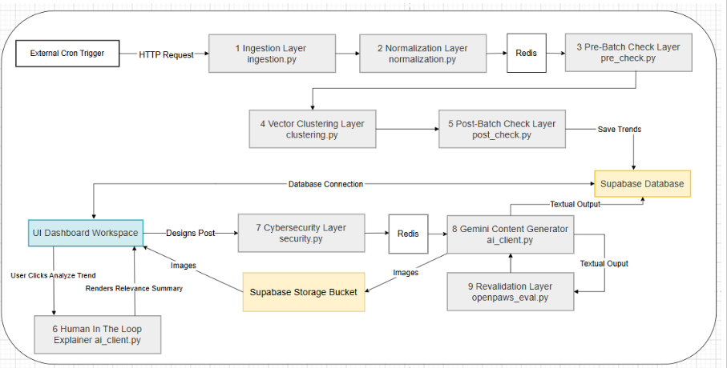

# Open Paws TrendFinder

Welcome to the **Open Paws TrendFinder**! This is an autonomous, end-to-end AI platform designed to ingest BlueSky data, semantically cluster them into emerging animal advocacy trends, and generate stunning, aesthetic visual content ready for publication.

This repository contains both the heavy-duty **Python/FastAPI Backend** (featuring a 10-phase automated AI pipeline) and the beautiful **React/Vite Frontend** dashboard designed for human-in-the-loop review.

---

## Architecture Overview



Open Paws TrendFinder is built to be modular, fast, and scalable. It shifts from simple cron jobs to a robust API-driven architecture that can be triggered asynchronously via queues or controlled directly from the frontend dashboard.

### Core Stack
* **Backend**: FastAPI (Python 3.11+) serving the REST API endpoints and global error interceptors.
* **Frontend**: React + Vite + TailwindCSS, featuring a clean, Apple-inspired aesthetic and Framer Motion micro-animations.
* **Database**: Supabase (PostgreSQL + pgvector) acting as the central nervous system for relational data, vector embeddings, Auth, and Blob Storage.
* **AI Models**: Google Gemini (Embeddings & Generation), Cerebras (Lightning-fast explainers), and Pollinations AI (Image generation).
* **Asynchronous Queue**: Upstash Redis handles background job queues (`rq`) so long-running LLM pipelines don't block web requests.
* **Discord Integration**: A fully interactive Discord Bot integrated directly into the FastAPI lifecycle.

---

## The 10-Phase AI Pipeline (Backend)

The heart of the application lives in `backend/app/pipeline/`. It executes a highly sequential, self-validating workflow to turn raw social media noise into ready-to-publish aesthetic content. 

### Discovery & Clustering
1. **Phase 1: Bluesky Ingestion**: Connects to Bluesky, actively polling for advocacy-related hashtags (e.g., `#animalrights`, `#vegan`). It pulls in a high volume of raw posts to feed the discovery engine.
2. **Phase 2: Normalization**: Cleans and standardizes the raw BlueSky data. It strips out malformed characters, normalizes URLs, and maps all inputs into a unified `Post` schema, ensuring downstream systems don't break on dirty data.
3. **Phase 3: Pre-Batch Check**: A fast local regex filter for normalized posts. It uses a configuration file to aggressively drop any posts containing blocked terms, banned sources, or blacklisted subreddits before passing them to the embedding generator.
4. **Phase 4: Vector Clustering (pgvector)**: Uses Google `gemini-embedding-2` to create 1024-dimensional semantic vectors for every post. It then executes a highly optimized Cosine Distance search (`<#>`) directly inside Supabase's `pgvector` to group semantically identical posts into emerging "Trends".
5. **Phase 5: Post-Batch Check**: Evaluates the newly clustered Trends as a single unit using `vaderSentiment`. It checks for strong advocacy keyword context, ensures a minimum cluster size, and decisively drops any clusters exhibiting an overwhelming negative sentiment consensus.

### Review & Generation
6. **Phase 6: Human in the Loop Trend Explainer**: Designed for the frontend dashboard. When a human reviews a trend, it triggers Cerebras (`gpt-oss-120b`) to instantly generate a rapid, 2-3 sentence AI explainer summarizing the core sentiment of the 50+ posts in the cluster.
7. **Phase 7: Cybersecurity Check**: A prompt-injection defence layer. Before sending data to the final generation stage, it scrubs known injection phrases (redacting them) and strictly wraps all surviving social-media text in XML delimiter tags (`<untrusted_social_media_data>`) so downstream LLMs treat it strictly as data, not instructions.
8. **Phase 8: Gemini Generation**: The creative engine. It formulates a complex prompt detailing the trend's "positioning angle" and calls Pollinations AI to generate stunning, minimalist, text-free visual artwork that perfectly encapsulates the trend's sentiment.
9. **Phase 9: Revalidation and Scoring**: Quality control. It scores the generated draft text against five hosted Open Paws prediction models (e.g., `open-paws/animal_advocate_preference_prediction_shortform`) via the HuggingFace API or local Transformers, selecting the highest-scoring composite draft.
10. **Phase 10: Closed-Loop Production Storage**: The final step. It securely signs and uploads the generated high-res images and JSON metadata into Supabase Storage Buckets. Strict user-level Row Level Security (RLS) policies ensure data isolation.

---

## The Frontend Dashboard

The `frontend/` directory contains a premium, highly responsive React application.

* **Design Philosophy**: Built with an Apple-inspired, light-mode aesthetic. It utilizes crisp typography (Inter font), soft glassmorphism shadows, and emerald green (`emerald-400`) accents to highlight recommended trends.
* **Micro-Animations**: Deeply integrated with `framer-motion` for buttery smooth page transitions, hover effects, and staggered list animations that make the interface feel alive.
* **Human-in-the-Loop Integration**: The dashboard connects securely to the FastAPI backend via Supabase JWTs. It allows users to browse clustered trends, trigger lightning-fast Cerebras AI explainers, and explicitly approve trends to kick off the final image generation phase.

---

## REST API Endpoints

The FastAPI backend exposes a clean REST API, grouped by functional routers. All routes are prefixed with `/api/v1`.

### Auth Router (`/auth`)
- `POST /login`: Authenticates users with Supabase Auth and returns an access token.
- `POST /logout`: Invalidates the current session.
- `GET /me`: Returns the currently authenticated user's profile information.

### Pipeline Router (`/pipeline`)
- `POST /discover`: Kicks off the discovery half of the pipeline (Phases 1-5). Can run synchronously or be offloaded to the Redis background queue.
- `POST /trigger`: An older endpoint to trigger legacy pipeline processes.

### Trends Router (`/trends`)
- `GET /`: Fetches a paginated list of clustered trends awaiting review on the dashboard.
- `POST /{trend_id}/explainer`: Triggers Phase 6, generating a lightning-fast summary for a specific trend cluster using Cerebras.
- `POST /{trend_id}/generate`: Kicks off the generation half of the pipeline (Phases 7-10) for an approved trend, yielding a final graphic.

### History Router (`/history`)
- `GET /`: Retrieves historical generated content and assets from the Supabase `trend-images` storage bucket.

---

## Global Error Interceptor
The backend features a robust global exception handler in `app/main.py`. If any API route completely crashes, the interceptor will catch it, prevent the server from halting, and write the full Python stack trace and request URL directly to the `api_error_logs` table in Supabase. 

---

## Discord Bot Integration
Bypass the web dashboard and interact with your database natively from Discord! The bot is physically integrated into the FastAPI server lifecycle and boots up automatically.
* **`!trends`**: Instantly fetches the top 5 highest-velocity trends from the last 24 hours.
* **`!explain <trend_id>`**: Generates an AI summary for a trend and replies directly in the chat.

*See `backend/docs/discord_bot.md` for full setup instructions.*

---

## Getting Started

### 1. Prerequisites
You need Python 3.11+, Node.js (v18+), and a fully configured Supabase project.

### 2. Database Migrations
Before running anything, execute the SQL scripts found in the `backend/migrations/` folder inside your Supabase SQL Editor. This scaffolds the vector tables, auth constraints, RLS policies, storage buckets, and global error logs.

### 3. Backend Setup
```bash
cd backend
cp .env.example .env  # Fill in your API keys!
python -m venv venv
source venv/bin/activate
pip install -r requirements.txt
uvicorn app.main:app --host 0.0.0.0 --port 8000 --reload
```

### 4. Frontend Setup
Open a new terminal window:
```bash
cd frontend
npm install
npm run dev
```
The React dashboard will be running at `http://localhost:5173`.

---

## Full Directory Structure
```text
OpenPaws_TrendFinder/
├── backend/
│   ├── app/
│   │   ├── api/v1/endpoints/       # FastAPI REST Routes (auth, pipeline, trends)
│   │   ├── core/                   # Config, Security (JWTs), Upstash Redis Queue
│   │   ├── pipeline/               # The 10-Phase Pipeline Logic (ingestion -> storage)
│   │   └── main.py                 # FastAPI Entrypoint & Global Error Interceptor
│   ├── docs/                       # Phase-by-phase architectural documentation
│   ├── migrations/                 # Supabase SQL scripts (RLS, schemas, buckets)
│   ├── discord_bot.py              # Discord.py interactive bot implementation
│   └── requirements.txt            # Python dependencies
└── frontend/
    ├── src/
    │   ├── components/             # Reusable React UI Components (Framer Motion, Shadcn style)
    │   ├── pages/                  # Main Views (Dashboard, Login)
    │   ├── App.jsx                 # Frontend Router
    │   └── index.css               # Tailwind & Global Styles
    ├── package.json                # Node dependencies
    └── vite.config.js              # Vite configuration
```
